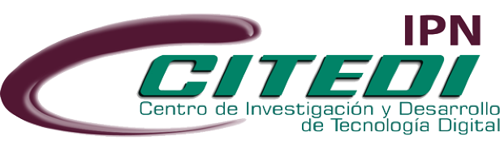

<!--  -->

<!--

📚 In my final semester of Master's at CITEDI - IPN.

💻 My research interests are quantum machine learning and computer vision.

🧑‍🎓 I'm interested in learning more about computer vision, machine learning and their applications in both industry and academia.

🤖 Proficiency
======
As of 2024, I have about 2 and a half years of experience in working on computer vision tasks, specifically image classification. I began studying machine and deep learning before I graduated university and have continued to work on them while on my master's. I graduated as a biomedical engineer with an interest in computer science applications on medical image analysis, such as the field of Computer Aided-Diagnosis. My thesis focuses on implementing quantum algorithms together with deep learning models in order to classify spine fracture X-ray images, taking advantage of some of the potential improvements quantum computing offers like increased efficiency and speed.

🔬 Research
======
During my master's studies, my colleagues, thesis advisor, and I have been working in spreading quantum machine learning implementations on real-world problems like medical image analysis. The research publications I've worked at the moment focus on these topics. Further information on them can be seen on my Google Scholar page. You can reach out to me +at: lopezdaniel1fmcet58@gmail.com if you have any questions.

🧠 Skills
------
- Machine Learning Development
- Data Analysis
- Dataset Building
- Hybrid Quantum Algorithms
- High Performance Computing
- English
- Japanese

-->
